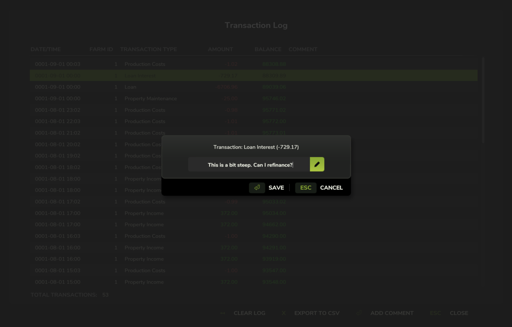
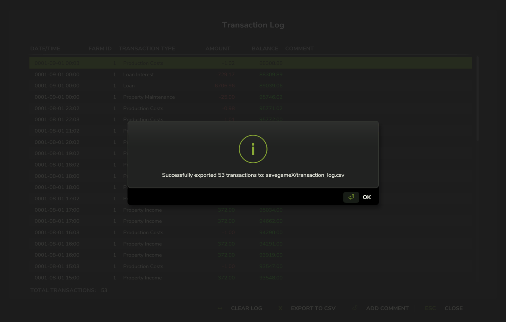
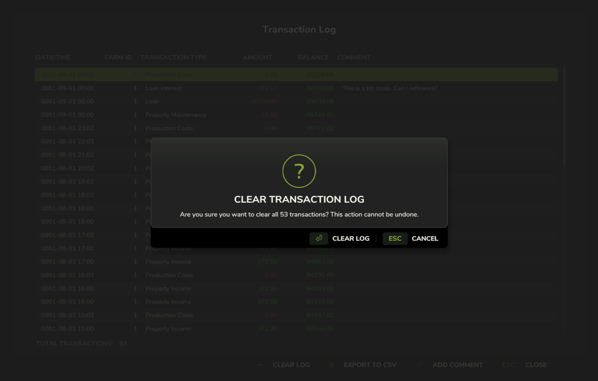

# FS25_TransactionLog

For the micromanagers out there that want to keep track of their farm's transactions, this mod adds a transaction log to
the game. Singleplayer only.

## Notes
This mod is currently in an early stage of development. It may not work as expected and could potentially cause issues with your game.
Since there is no proper documentation for modding FS25 yet, this mod is made by trial and error and looking at other mods.

Default key binding is `Right Shift + T` to open the transaction log interface. You can change this in the game settings under "Controls".

Landscaping creates a lot of small transactions. Using a free landscaping mod is recommended.

## Features
- View all transactions in a log
- Add comments to transactions
- Export transactions to a CSV file
- Clear the transaction log

## Screenshots
Transaction log interface with a list of transactions, including date, type, amount, and comments.

Adding a comment to a transaction.

Exporting transactions to a CSV file.

Clearing the transaction log.

