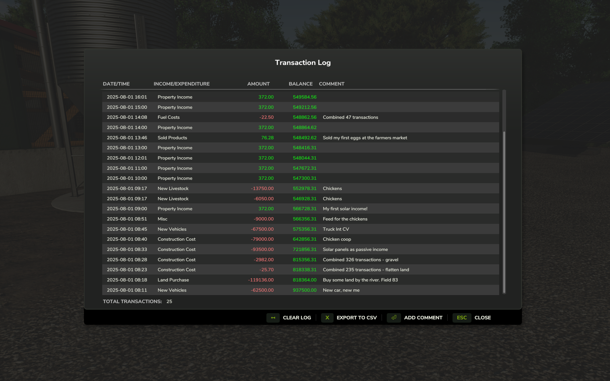

# FS25_TransactionLog

For the micromanagers out there that want to keep track of their farm's transactions, 
this mod adds a transaction log to the game. 

**Singleplayer only.**

## Notes
This mod is currently in development. It may not work as expected and could potentially cause issues with your game.
Since there is no proper documentation for modding FS25 yet, this mod is made by trial and error and looking at other mods.

Default key binding is `Right Shift + T` to open the transaction log interface. You can change this in the game settings under "Controls".

## Features
 - **Transaction Logging**: Automatically tracks all financial transactions (income and expenses) in real-time
  - **Transaction combining**: Groups frequent small transactions (landscaping, fuel purchase etc) to reduce log clutter.
  - **GUI Interface**: View transaction history in an in-game dialog (accessible via RightShift+R)
  - **Transaction Details**: Display ingame date/time, transaction type, amount, and current farm balance
  - **Add Comments**: Edit and add custom comments to individual transactions
  - **Export to CSV**: Export transaction history to CSV files in the mod settings directory
  - **Clear Transaction Log**: Remove all stored transactions with confirmation dialog
  - **Persistent Storage**: Automatically save and load transaction data with your savegame

## Screenshots
Transaction log interface with a list of transactions, including date, type, amount, and comments.

